# JHB Automations — System Architecture

**Version:** 1.0 · **Status:** Living document · **Audience:** Developers, designers, PMs, future team members

> This document describes the **as-built** architecture. Where the system differs from a
> conventional Node/Express stack, the real design is documented first and the conventional
> equivalent is noted as an alternative. Items not yet built are tagged **🔭 Planned**.

---

## 0. TL;DR — What this actually is

A **monorepo** containing **two independent Next.js 15 apps** that share one TypeScript package and **one Supabase project** as the backend (Postgres + Auth + Storage + Row-Level Security).

- **Public Website** (`apps/website`, port 3000) — marketing site, SSR, reads published content.
- **Admin Dashboard** (`apps/admin`, port 3001) — Super-Admin CMS, auth-guarded, writes content.
- **`@jhb/shared`** (`packages/shared`) — Supabase clients, data access, types, content models.
- **Backend = Supabase (BaaS):** Postgres DB, GoTrue Auth (JWT), Storage bucket, PostgREST API, RLS for authorization. Mutations run through **Next.js Server Actions**; the "API layer" is Server Actions + Supabase PostgREST rather than a standalone Express/Nest service.

---

## 1. High-Level Architecture

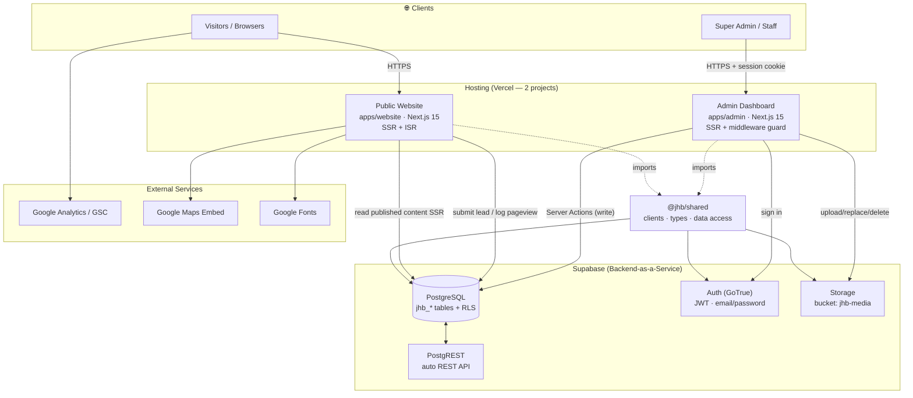

**Layer responsibilities**

| Layer | Implementation | Notes |
|---|---|---|
| Public Website | `apps/website` (Next 15 App Router, RSC, Framer Motion) | SSR reads from Supabase via `@jhb/shared` server fns |
| Admin Dashboard | `apps/admin` (Next 15) | `middleware.ts` guards all routes except `/login` |
| Database | Supabase Postgres, `jhb_` prefixed tables | shared project; RLS on every table |
| Authentication | Supabase Auth (GoTrue, JWT) + `@supabase/ssr` cookie sessions | roles in `jhb_profiles` |
| Media Storage | Supabase Storage bucket `jhb-media` (public) | client-side compression before upload |
| API Layer | Next.js **Server Actions** (writes) + Supabase server client (reads) + PostgREST | no separate API server |
| SEO Layer | `generateMetadata`, `sitemap.ts`, `robots.ts`, JSON-LD, `jhb_seo`, link manager | per-page canonical + schema |
| Analytics Layer | `jhb_pageviews` (first-party) + admin `/analytics`; GA/GSC 🔭 | `PageViewTracker` beacon |
| Lead Management | `jhb_leads` + public contact form + admin `/leads` | status workflow new→contacted→closed |

---

## 2. Public Website Architecture

### Routes (implemented)

```
/                       Home (Hero, Partners, About, Services, Stats, Testimonials,
                              Process, Founder, Client Logos, FAQ, Blog preview, CTA, Contact)
/about                  About page
/contact                Contact page (form → jhb_leads)
/services               Services index (grid)
/services/[slug]        Dynamic service page (SSR, dynamicParams)
/blog                   Blog listing + ?q= search
/blog/[slug]            Blog article (BlogPosting schema, related, share)
/sitemap.xml            Dynamic sitemap
/robots.txt             Robots
```

**🔭 Planned:** `/privacy`, `/terms`, dedicated landing pages, blog **category** pages (category is stored on posts; no per-category route yet).

### Page composition

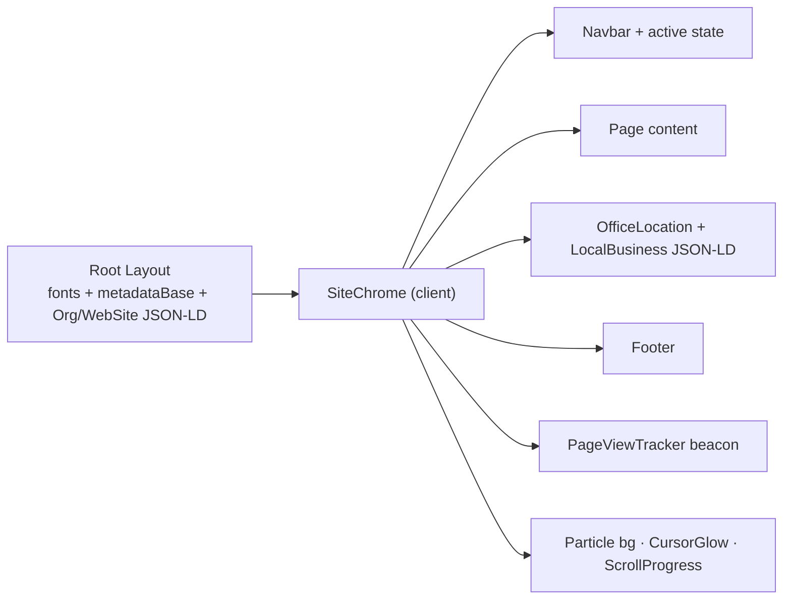

### Reusable components (`apps/website/src/components`)

`Navbar`, `Footer`, `SiteChrome`, `Hero`, `Partners`, `AboutSection`, `Services`, `Stats`,
`Testimonials`, `Process`, `FounderPerspective`, `ClientLogos`, `Faq`, `FaqAccordion`,
`BlogPreview`, `PostCard`, `ShareButtons`, `CtaSection`, `Contact`, `OfficeLocation`,
`Breadcrumbs`, `ServiceDetail`, `Reveal`, `SectionHeading`, `Icon`, `ParticleBackground`,
`CursorGlow`, `ScrollProgress`, `PageViewTracker`.

### Rendering & data flow

- Pages are **server components**; they call `@jhb/shared/*-server` functions which use the cookie-aware Supabase client → effectively **SSR/dynamic** so admin edits appear on next request.
- Home/Hero/Stats/Settings/Services/FAQ/Links are read from DB with **code-based fallbacks** (`data.ts`) so the site renders even before any admin edit.

---

## 3. Super Admin Dashboard Architecture

### Modules (implemented routes in `apps/admin`)

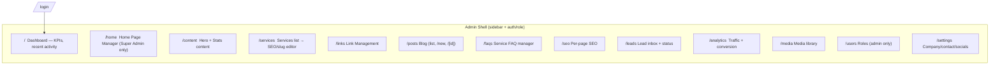

| Module | Backing table(s) | Capabilities |
|---|---|---|
| Dashboard | `jhb_leads`, `jhb_pageviews`, `jhb_media`, `jhb_activity_log` | KPI counts + recent activity |
| Home Page Mgmt | `jhb_home` (draft/published) | hero, about, services heading, service cards, CTA + **live preview**, publish |
| Content | `jhb_content` (`hero`,`stats`) | hero text + animated stats |
| Services Mgmt | `jhb_services` | slug, meta title/desc/keywords (content base in `data.ts`) |
| Link Mgmt | `jhb_service_links` | anchor→URL, internal/external, validation, auto-link on page |
| Blog Mgmt | `jhb_posts` | CRUD, draft/publish, cover image, category, tags, SEO |
| FAQ Mgmt | `jhb_service_faqs` | per-service add/edit/delete + drag reorder, FAQ schema |
| SEO Mgmt | `jhb_seo` | per-path title/desc/keywords/OG; sitemap & robots auto |
| Lead Mgmt | `jhb_leads` | inbox, status (new/contacted/closed), delete |
| Media Library | `jhb_media` + bucket | drag-drop upload, compression, copy URL, delete |
| User Mgmt | `jhb_profiles` | view users, change role (admin only) |
| Settings | `jhb_settings` | company, contact, hours, socials |

**🔭 Planned (from spec, not yet built):** standalone Service Categories, Case Studies module, Quote-request lead type, Redirects manager, video/document media types.

---

## 4. Database Architecture

**Engine:** PostgreSQL (Supabase). All tables prefixed `jhb_` (the project is shared with another app). **RLS enabled on every table.**

### ER diagram (as-built)

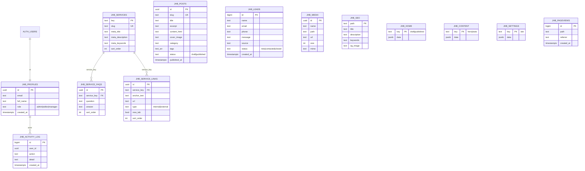

### Mapping to the requested conceptual schema

| Requested entity | As-built table | Notes |
|---|---|---|
| users + roles | `jhb_profiles` (role column) + `auth.users` | role enum, not a separate roles table |
| services | `jhb_services` (+ rich content in `data.ts`) | DB stores slug/SEO/order |
| service_categories | 🔭 Planned | not yet a table |
| service_faqs | `jhb_service_faqs` | ✅ |
| blogs | `jhb_posts` | ✅ |
| blog_categories / blog_tags | `category` text + `tags text[]` on `jhb_posts` | denormalised; tables 🔭 |
| testimonials / clients / case_studies | `jhb_home.data` (testimonials) + `data.ts` | dedicated tables 🔭 |
| leads / contact_submissions | `jhb_leads` (`source` distinguishes) | ✅ |
| media_library | `jhb_media` + Storage bucket | ✅ |
| seo_settings | `jhb_seo` + per-service meta in `jhb_services` | ✅ |
| redirects | 🔭 Planned | |
| settings | `jhb_settings` | ✅ |

**Authorization helper:** `public.jhb_role()` (SECURITY DEFINER) returns the caller's role for RLS policies; `jhb_handle_new_user()` trigger seeds a profile on signup.

---

## 5. API Architecture

The app uses **Next.js Server Actions** for writes and the **Supabase server client** for reads. Supabase also exposes an auto-generated **PostgREST** API (`/rest/v1/<table>`) protected by the same RLS. The conventional REST contract below maps to these.

### Server Actions (admin) — `apps/admin/src/app/actions.ts`

| Action | Conceptual REST | Auth |
|---|---|---|
| `saveContent(key,data)` | `PUT /api/content/:key` | staff |
| `saveSettings(data)` | `PUT /api/settings` | staff |
| `saveHomeDraft` / `publishHome` | `PUT /api/home/draft` · `POST /api/home/publish` | **admin** |
| `saveService(key,…)` | `PUT /api/services/:key` | staff |
| `savePost` / `deletePost` | `POST/PUT /api/blogs` · `DELETE /api/blogs/:id` | staff |
| `saveServiceFaqs(key,items)` | `PUT /api/services/:key/faqs` | staff |
| `saveServiceLinks(key,items)` | `PUT /api/services/:key/links` | staff |
| `saveSeo(path,…)` | `PUT /api/seo` | staff |
| `updateLeadStatus` / `deleteLead` | `PATCH/DELETE /api/leads/:id` | staff |
| `uploadMedia` / `deleteMedia` | `POST/DELETE /api/media` | staff |
| `updateUserRole(id,role)` | `PUT /api/users/:id/role` | **admin** |

### Public actions — `apps/website/src/app/actions.ts`

| Action | Conceptual REST | Auth |
|---|---|---|
| `submitLead(input)` | `POST /api/leads` | public (RLS insert) |
| pageview insert (client) | `POST /api/pageviews` | public (RLS insert) |

### Reads (SSR) — `@jhb/shared/*-server`
`getHero/getStats/getSettings/getSeo/buildMetadata`, `getServices/getServiceBySlug`,
`getPublishedPosts/getPostBySlug/getRelatedPosts`, `getServiceFaqs`, `getServiceAnchorLinks`,
`getPublishedHome`. Equivalent to `GET /api/...` but executed server-side with RLS.

**Permissions model:** every endpoint is authorized by **RLS**, not app code — public can read published rows + insert leads/pageviews; `admin|editor|manager` can write content; `admin` only for home page + user roles.

---

## 6. SEO Architecture

| Concern | Implementation |
|---|---|
| robots.txt | `app/robots.ts` — allow public, disallow `/admin /dashboard /login /api`, sitemap ref |
| XML sitemap | `app/sitemap.ts` — home, services (+slugs), blog (+published slugs), about, contact |
| Canonical URLs | `metadataBase` + `alternates.canonical` on every route |
| Open Graph / Twitter | site-wide defaults + per-page in `generateMetadata` |
| Organization + WebSite schema | root layout JSON-LD (+ `SearchAction` → `/blog?q=`) |
| LocalBusiness schema | `OfficeLocation` (NAP, hours, geo area, hasMap) on every page |
| Service schema | per service page (`Service` + provider) |
| BlogPosting schema | per blog article |
| FAQ schema | home FAQ + per-service `FAQPage` |
| Breadcrumb schema | `Breadcrumbs` component + per-page `BreadcrumbList` |
| Internal linking | **Link Manager** (`jhb_service_links`) auto-links anchor phrases in service content |

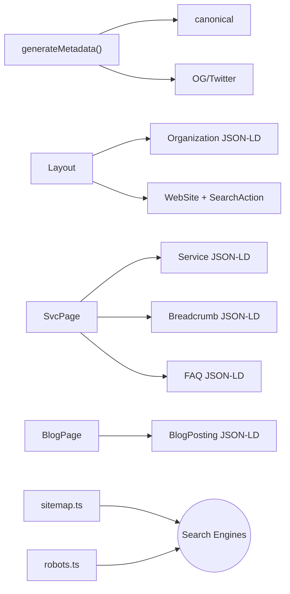

---

## 7. Security Architecture

| Control | Status | Detail |
|---|---|---|
| Authentication | ✅ | Supabase Auth (GoTrue) issues **JWT**; `@supabase/ssr` stores session in httpOnly cookies; `middleware.ts` refreshes + guards admin |
| Authorization (RBAC) | ✅ | **RLS policies** keyed on `jhb_role()` (admin/editor/manager); admin-only for Home + user roles |
| Admin isolation | ✅ | Separate app/origin; `robots` noindex; middleware redirects unauthenticated → `/login` |
| SQL injection | ✅ | All access via parameterised Supabase client / PostgREST (no string-built SQL) |
| XSS | ⚠️ Partial | React escapes by default; rich HTML (`content_html`, FAQ/CTA) is admin-authored and rendered via `dangerouslySetInnerHTML` — **sanitize server-side** (recommend `sanitize-html`/DOMPurify) 🔭 |
| CSRF | ✅ (mostly) | Server Actions use same-site POST + cookie; add explicit origin checks for any public POST 🔭 |
| Rate limiting | 🔭 | Add on lead/pageview inserts (Vercel middleware / Supabase edge / WAF) |
| Audit logs | ✅ | `jhb_activity_log` records actor + action + detail on every admin mutation |
| Secrets | ✅ | Only the publishable/anon key in `NEXT_PUBLIC_*`; service-role key never shipped |

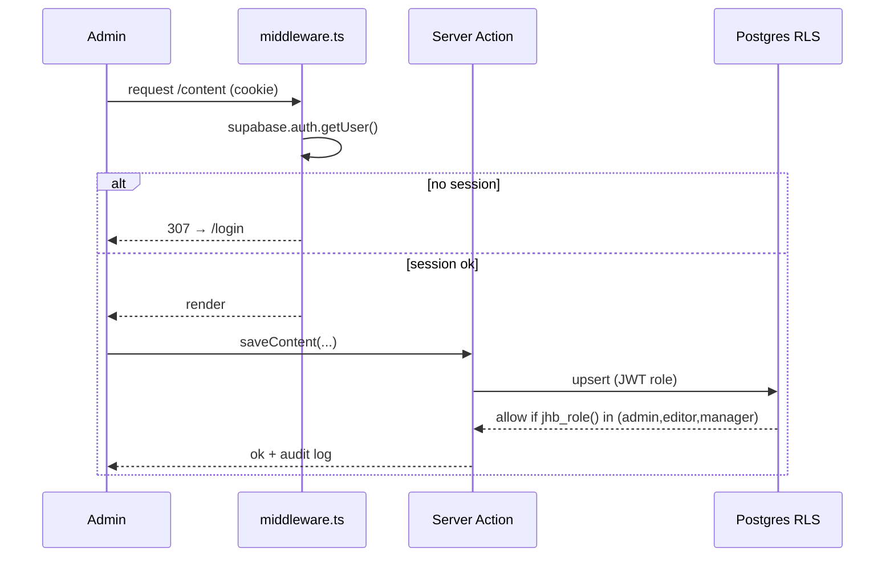

---

## 8. Deployment Architecture

### As-built / recommended

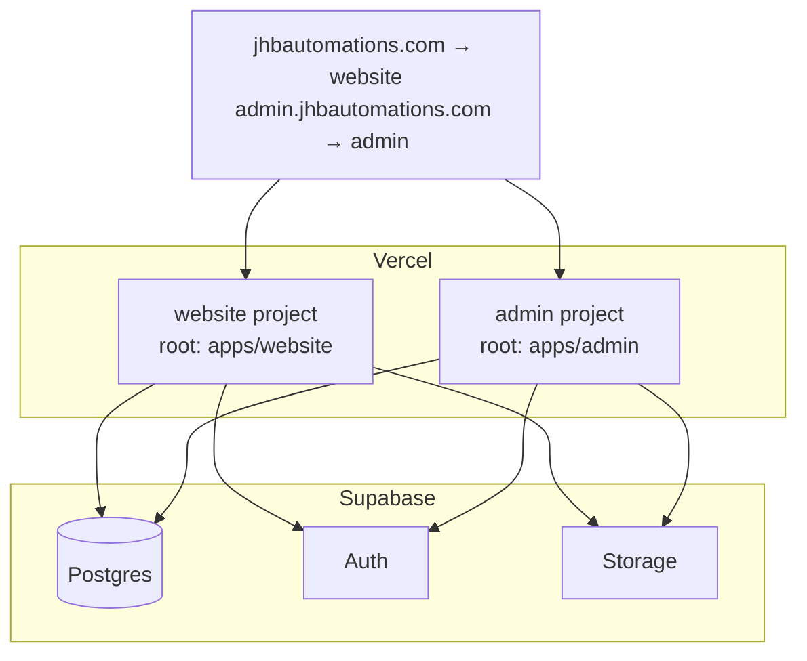

| Concern | Recommended |
|---|---|
| Frontend | **Next.js 15 + TypeScript + Tailwind** (as built) |
| Backend | **Supabase** (Postgres + Auth + Storage + RLS) — replaces Express/Nest |
| Storage | Supabase Storage (Cloudinary/S3 optional for transforms) |
| Hosting | **Vercel** — two projects (website, admin), monorepo root dirs |
| Env | `NEXT_PUBLIC_SUPABASE_URL`, `NEXT_PUBLIC_SUPABASE_ANON_KEY`, `NEXT_PUBLIC_SITE_URL`, `NEXT_PUBLIC_WEBSITE_URL` |
| Monitoring | GA4 + Google Search Console + **Sentry** (error tracking) 🔭 |
| CI/CD | Vercel Git integration; preview deploys per PR |

> **If a dedicated backend is later required** (the spec's Node/Express/NestJS option): introduce a NestJS service in front of Postgres, move Server Actions → REST controllers, and keep RLS as defence-in-depth. Not needed at current scale.

---

## 9. User Flow Diagrams

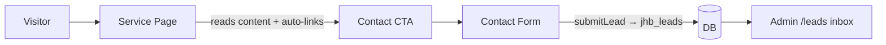

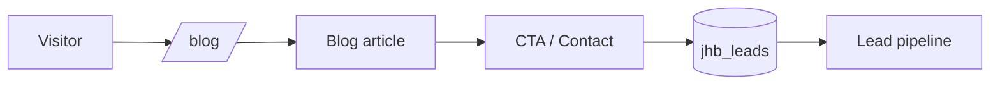

```mermaid
flowchart LR
  Ad[Admin] --> S[/services] --> E[Edit slug + SEO]
  E -->|saveService| DB[(jhb_services)]
  DB --> Pub[Public service page SSR]
```

```mermaid
flowchart LR
  Ad[Admin] --> P[/posts/new] --> W[Write + cover + SEO]
  W -->|savePost status=published| DB[(jhb_posts)]
  DB --> Sm[sitemap + /blog]
```

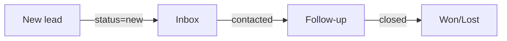

---

## 10. Scalability Roadmap

| Stage | Traffic | Strategy |
|---|---|---|
| **Launch** | ~100/day | Current setup: Vercel + Supabase free/pro, SSR. No changes needed. |
| **Growth** | ~1,000/day | Switch hot public pages from per-request SSR to **ISR** (`revalidate`) + on-demand revalidation webhook from admin on publish; enable Vercel Edge cache. |
| **Scale** | ~10,000/day | CDN for all static/ISR; add **indexes** on `jhb_posts(status,published_at)`, `jhb_pageviews(created_at)`; move pageview writes to batched/edge; Supabase connection pooling (PgBouncer). |
| **High scale** | ~100,000/day | Read replicas / Supabase compute upgrade; aggregate analytics into rollup tables (cron) instead of scanning `jhb_pageviews`; rate-limit + WAF; object storage on CDN; consider splitting analytics to a dedicated pipeline. |

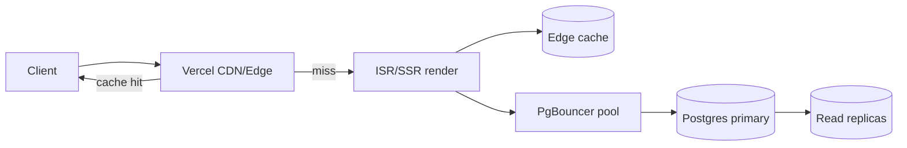

---

## Appendix A — Folder Structure

```
JHB-website/
├─ package.json                 # npm workspaces root
├─ tsconfig.base.json
├─ docs/
│  ├─ ARCHITECTURE.md           # this file
│  └─ migration-guide.md
├─ packages/shared/             # @jhb/shared (logic only)
│  └─ src/
│     ├─ supabase/{client,server}.ts
│     ├─ content.ts · content.server.ts
│     ├─ data.ts                # canonical service content + nav
│     ├─ services.server.ts
│     ├─ home.ts · home.server.ts
│     ├─ posts.ts · posts.server.ts
│     ├─ faqs.ts · faqs.server.ts
│     ├─ serviceLinks.ts · serviceLinks.server.ts
│     └─ types.ts
├─ apps/website/                # public (:3000)
│  └─ src/{app, components}
└─ apps/admin/                  # admin (:3001)
   └─ src/{middleware.ts, app, components}
```

## Appendix B — Best-Practice Recommendations (Production)

1. **Sanitize admin HTML** (`content_html`, FAQ/CTA) on save with DOMPurify/sanitize-html — closes the XSS gap.
2. **Set `NEXT_PUBLIC_SITE_URL`** to the real domain so canonicals/OG/sitemap use production URLs.
3. **Add `logo.png` + `og.png`** to `apps/website/public` (Organization logo + social share image).
4. **Switch public content pages to ISR** + on-demand revalidation webhook the admin calls after publish (decouples the two apps' caches).
5. **Add Sentry** to both apps; wire **GA4 + GSC** (first-party pageviews already exist).
6. **Rate-limit** public inserts (leads/pageviews) and add an origin check.
7. **Rotate** the seeded admin password; enable Supabase **leaked-password protection**.
8. **Pin & patch** Next.js (currently 15.1.6 — apply the security update on the next maintenance pass).
9. **Promote denormalised fields to tables** when needed: blog categories/tags, testimonials, clients/case-studies, redirects.
10. **Daily DB backups** (Supabase automatic on paid tiers) + periodic content JSON export.
```
